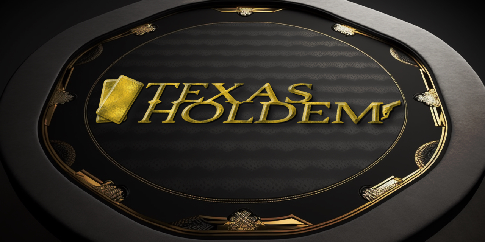

# Texas Hold'em Game [](https://opensource.org/license/mit/)

This is a Texas Hold'em game written in Java with OpenJDK 17.0.2, Maven and JavaFX.
primarily for Windows

## Author
This game was developed by:
- Torgrim Thorsen [@SirAlexiner](https://github.com/SirAlexiner)

The project is hosted on [NTNU GitLab](https://git.gvk.idi.ntnu.no/Nintendo_Alex/poker-texas-holdem)

The code will soon be hosted on the authors personal [GitHub](https://github.com/SirAlexiner).

## Roadmap

- Fix issue with screen resolution and the game's size.
- Different OS Support
- Attach change listener to auto-update light/dark mode in OS mode when changed on OS level
- Possible Steam/Itch.io release

## Contributors
There have been no contributors to this project so far.

Contributions to this project are welcome! If you would like to contribute, please follow these guidelines:

- Fork the repository.
- Clone your forked repository to your local machine.
- Create a new branch for your changes.
- Make your changes and commit them with clear and concise commit messages.
- Push your changes to your forked repository.
- Submit a request to the original repository, explaining your changes and why they should be included.
  
Please note that we will only accept contributions that are consistent with the game's purpose and goals. Additionally, any contributions must follow the `Code of Conduct` outlined in the [`conduct.md`](conduct.md), then read and agree to the [`contribute.md`](contribute.md) file

As previously mentioned, there have not been any contributions to this project so far, but we welcome any feedback or suggestions. If you encounter any issues or have ideas for improvements, please open up an issue.

## Attribution
The audio files and images used in this game are either created personally, by AI or used under the following licenses from [OpenGameArt.org](https://opengameart.org/):

[](https://creativecommons.org/licenses/by-sa/3.0/)
[](https://opensource.org/license/unlicense/)
[](https://opensource.org/license/gpl-3-0/)
[](https://opensource.org/license/gpl-2-0/)

  Credit goes to the following artists:

- Remaxim - Music
- Minime453 - Playing Card Graphics
- [Kenney](https://www.kenney.nl/) - Casino Sound Effects
- Michael Klier - Sound Effect


## Features

- Light/dark mode toggle
- Fullscreen mode
- Sound effects and music to enhance the game experience.
  - Mute option to play silently
- 3D Objects with real-time animations, and lighting.
- Main Menu
- Settings


## License

This project is licensed under:

[](https://opensource.org/license/mit/)

You are free to download and use the code for academic or non-commercial purposes, but distribution, selling, or capitalizing on the project is strictly prohibited.

## How to Install
Clone the repository:
```bash
    git clone https://github.com/SirAlexiner/poker-texas-holdem.git
```
Change directory to the cloned repository:
```bash
    cd poker-texas-holdem
```
Build the project using Maven:
```java
    mvn package
```
Run the game:
```bash
    java -jar target/poker-texas-holdem-1.0.jar
```

# Dependencies
This project has the following dependencies:

- [Lombok](https://projectlombok.org/)
- [jSystemThemeDetector](https://github.com/Dansoftowner/jSystemThemeDetector)
- SLF4J
- [Atlantafx Base](https://github.com/mkpaz/atlantafx)
- JNA
- JNA Platform
- JavaFX Controls
- JavaFX Media
- [Ikonli JavaFX](https://github.com/kordamp/ikonli)
- [Ikonli Feather Pack](https://github.com/kordamp/ikonli)
- JUnit Jupiter (Testing)

All dependencies are managed by Maven.

These dependencies are required to run and build the project.

If you need to you can install the dependencies using Maven by running the following command:
```java
    mvn install
```
Make sure you have a compatible version of Java installed on your system.

If you encounter any issues with the dependencies or the project setup, please refer to the documentation or open up an issue.

## How to Use
The game is a graphical user interface application. Once you run the game, a window will appear where you can start playing.

To play the game, simply follow the rules of Texas Hold'em. Enjoy!

## Documentation

[Development Documentation](docs/DevDoc.pdf)